# MapKit in SwiftUI

## Chuẩn bị

Chúng ta sẽ tìm hiểu về Map & MapKit mới nhất với SwiftUI. Do đó, bạn cần sử dụng các OS version và tools mới nhất nhóe.

## Map & MapKit

Nếu bạn đã từng là một người theo dõi sự phát triển của SwiftUI ngay từ những ngày đầu, thì việc sử dụng Map rất vất vả. Nó chủ yếu là cầu nối từ UIKit sang SwiftUI mà thôi. Và rồi cũng tới ngày là ta có thể dụng Map trên SwiftUI khá đơn giản.

Xem qua ví dụ đơn giản như sau nha:

```swift
import SwiftUI
import MapKit

struct ContentView: View {
    var body: some View {
        VStack {
            Map()
        }
        .padding()
    }
}
```

Trong đó:

* Bạn cần `import` MapKit để sử dụng nhóe
* Gọi thẻ `Map()`

Bạn chờ một tí, màn hình Preview sẽ hiển thị ra như sau:

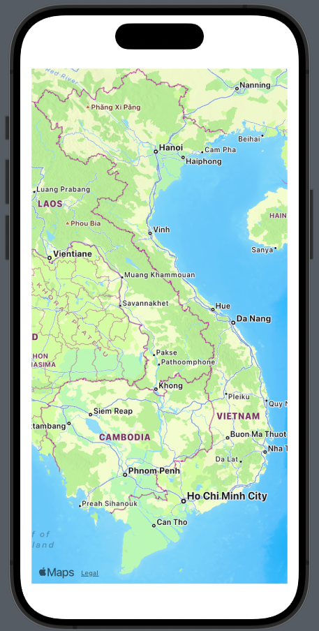

Nếu đơn giản không có bất kì tham số hay content gì cho Map, thì Apple sẽ dựa vào wifi/gps/4g ... của bạn mà hiển thị Map đúng ở quốc gia hay nơi bạn đang đứng. Khá EZ!

## Marker & Annotation

Công việc tiếp theo, ta sẽ thêm nội dung vào Map. Ta sẽ có tùy chỉnh 2 loại cơ bản là Marker và Annotation. Ta sẽ chuẩn bị 1 địa điểm cụ thể nhóe.

```swift
extension CLLocationCoordinate2D {
    static let dragonBridge = CLLocationCoordinate2D(latitude: 16.06101183799654, longitude: 108.22761720565889)
}
```

Đây là vị trí của Cầu Rồng, Đà Nẵng. Mình tạo một biến `static` để tiện sử dụng cho các đoạn code ở dưới.

### Marker

Marker dùng để đánh dấu một vị trí trên bản đồ. Mặc định, nó là một cái hình bong bóng và hiện thị tên của địa điểm trên bản đồ. Về code SwiftUI cho MapKit mới, bạn sẽ code như thế này:

```swift
            Map {
                Marker("Dragon Bridge", coordinate: CLLocationCoordinate2D.dragonBridge)
            }
```
Trong đó:

* Marker là đối tượng sử dụng trong Map
* Bạn chỉ cần thêm các tham số cơ bản mà thôi

So ra, SwiftUI khá đơn giản so với UIKit hỉ. Kết quả ở Preview như sau:

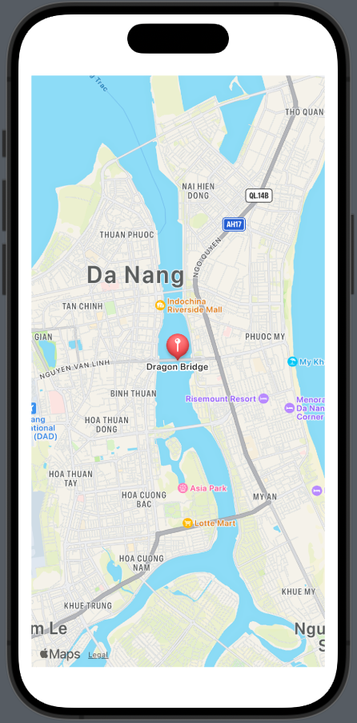

### Annotation

Cũng tương tự như Marker, nhưng chúng ta có thể tùy biến nó nhiều hơn. Cấu trúc cơ bản của một Annotation mới như sau:
* `coordinate` chưa thông tin tọa độ cơ bản 2D
* `content` phần hiển thị chính, bạn có thể nhét các View,Image ....
* `label` hay `title` tùy thuộc bạn muốn hiển thị nội dung cho tên của nó như thế nào mà lựa chọn phù hợp.

Ví dụ code nha!

```swift
                Annotation("Cầu Rồng", coordinate: CLLocationCoordinate2D.dragonBridge) {
                    Image(systemName: "flame.circle.fill")
                                .padding (4)
                                .foregroundStyle(.white)
                                .background (Color.red)
                                .cornerRadius (4)
                }
 ```
 
 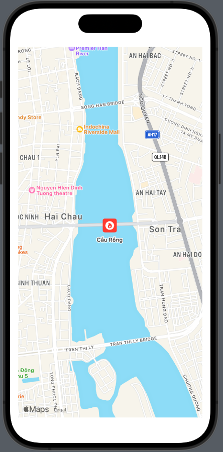
 
 Ngoài ra, Annotation có một tham số khá là thú vị. Đó là `anchor`. Nó sẽ quyết định nội dung của Annotation sẽ đặt theo hướng nào so với tọa độ điểm. Xem ví dụ code tiếp nhóe
 
 ```swift
             Map {
                Marker("Dragon Bridge", coordinate: CLLocationCoordinate2D.dragonBridge)
                Annotation("Cầu Rồng", coordinate: CLLocationCoordinate2D.dragonBridge, anchor: .top) {
                    Image(systemName: "flame.circle.fill")
                                .padding (4)
                                .foregroundStyle(.white)
                                .background (Color.red)
                                .cornerRadius (4)
                }
            }
```
 
 Trong đó, mình sử dụng luôn cả 2 Marker & Annotation cùng một vị trí. Và xét `anchor = top`, bạn xem qua hình kết quả là có thể hiểu được liền.
 
 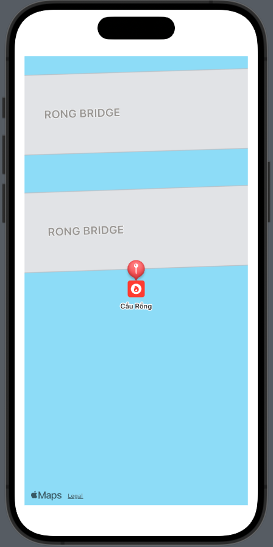
 
 EZ nhĩ!
 
 ## Map Styles
 
 Với SwiftUI & MapKip, bạn có thể thay đổi một vài kiểu style cho bản đồ. Chỉ cần thêm modifier `.mapStyle()` cho Map là được. Chúng ta sẽ có cơ bản một vài kiểu như sau:
 
 * Bản đồ truyền thống
 * Có giao thông
 * Bạn đồ thực tế
 * Kết hợp
 * ...

 Ví dụ code cơ bản:
 
 ```swift
 .mapStyle(.standard)
 
 // or
 .mapStyle(.standard(elevation: .realistic))
 
 // or
.mapStyle(.imagery(elevation: .realistic))

 // or
.mapStyle(.hybrid(elevation: .realistic))
 ```
 
 Mình liệt kê vài hình cơ bản thôi nha.
 
  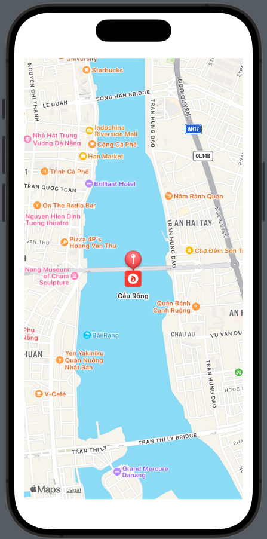
  
  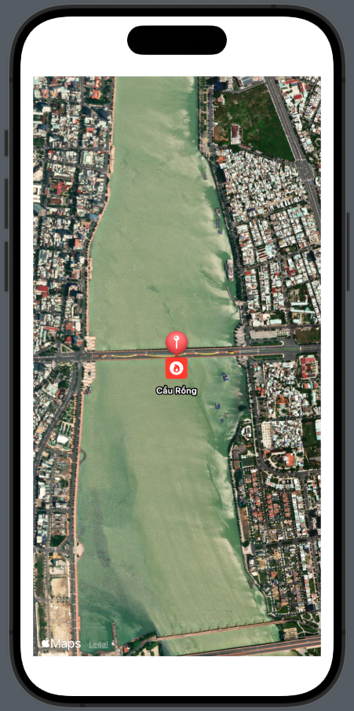
   
  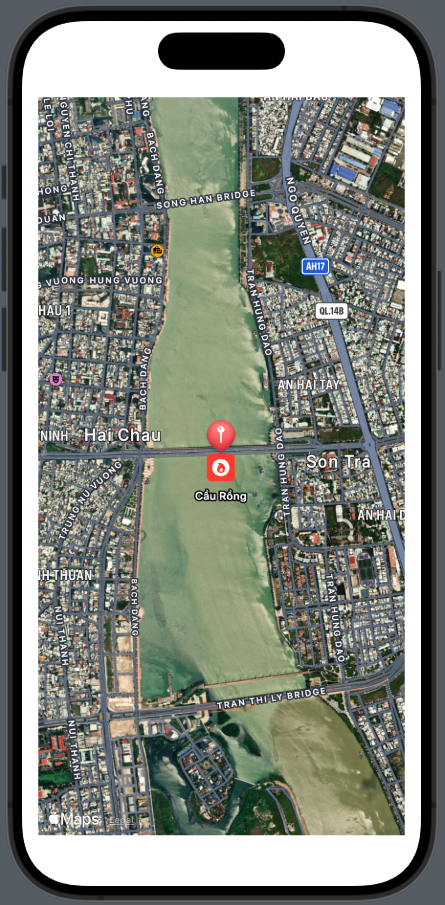
 
## Region

Bạn để ý một điều là Map trên SwiftUI sẽ hầu như tự động điều chỉnh vị trí hiện thị theo một số tiêu chí mặc định. Như wifi, marker, annotation ... Như vậy, muốn để hiển thị Map theo ý mình, thì bạn cần sử dụng tới một cách mới. Đó là `initialPosition`, tức là khởi tạo Map với một vị trí nào đó.

Đây là một điểm nâng cấp của MapKit trên SwiftUI, nhằm phù hợp với nền tảng này. Chúng ta sẽ tìm hiểu cách hiển thị theo từng vùng (`region`) như thế nào nhóe.
 
### Setup View
 
 Trước tiên, ta sẽ thay đổi một chút giao diện lại như sau:
 
 ```swift
     var body: some View {
        VStack {
            VStack {
                //MAP
                Map()
                
                //REGION BUTTONS
                HStack {
                    //region #1
                    Button {
                        // code here
                    } label: {
                        Label("1", systemImage: "1.square.fill")
                    }
                    .buttonStyle(.borderedProminent)
                    
                    //region #2
                    Button {
                        // code here
                    } label: {
                        Label("2", systemImage: "2.square.fill")
                    }
                    .buttonStyle(.borderedProminent)
                    
                    //region #3
                    Button {
                        // code here
                    } label: {
                        Label("3", systemImage: "3.square.fill")
                    }
                    .buttonStyle(.borderedProminent)
                }
                .labelStyle(.iconOnly)
            }
        }
        .padding()
    }
 ```
 
Thay đổi lại layout một chút nha, thêm các Button cho các vùng muốn hiển thị. Giao diệu tạm thời thế này!
 
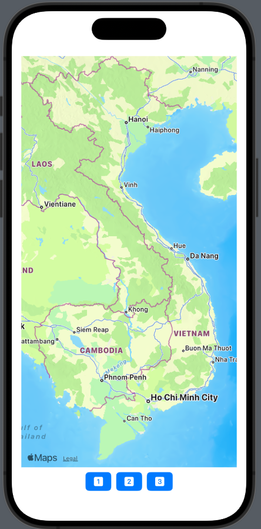
 
### MKCoordinateRegion
 
Sau khi đã có UI ưng ý, bạn tới bước chuẩn bị dữ liệu nhóe. Đối tượng MKCoordinateRegion sẽ được dùng để quản lý hiển thị của Map theo từng vùng. Do đó, ta cần chuẩn bị vài vùng cần hiển thị trước tiên. Xem code ví dụ sau:
 
```
 extension CLLocationCoordinate2D {
    static let turtleTower = CLLocationCoordinate2D(latitude: 21.027910, longitude: 105.852298)
    static let dragonBridge = CLLocationCoordinate2D(latitude: 16.06101183799654, longitude: 108.22761720565889)
    static let benthanhMarket = CLLocationCoordinate2D(latitude: 10.772823166683567, longitude: 106.69893065796946)
}

extension MKCoordinateRegion {
    static let turtleTower = MKCoordinateRegion(
        center: CLLocationCoordinate2D.turtleTower,
            span: MKCoordinateSpan(latitudeDelta: 0.1, longitudeDelta: 0.1)
    )
    
    static let dragonBridge = MKCoordinateRegion(
        center: CLLocationCoordinate2D.dragonBridge,
            span: MKCoordinateSpan(latitudeDelta: 0.1, longitudeDelta: 0.1)
    )
    
    static let benthanhMarket = MKCoordinateRegion(
        center: CLLocationCoordinate2D.benthanhMarket,
            span: MKCoordinateSpan(latitudeDelta: 0.1, longitudeDelta: 0.1)
    )
}
```

Ta có 2 extension cho CLLocationCoordinate2D & MKCoordinateRegion. Với Region, bạn cần khởi tạo với 2 tham số chính:

* `center` : tọa độ trung tâm
* `span` : kích thước vùng hiển thị

### MapCameraPosition

Vì đây là SwiftUI, nên mình sẽ cố gắng hướng tới việc hướng dẫn sao cho đúng tư tưởng của nền tảng lập trình này. Do đó, ta sẽ không dùng cách `init` trực tiếp `position` vào Map. Mà sẽ tạo một biến State để quản lý `position`.

Trước tiên, chúng ta sẽ thêm một thuộc tính cho View:

```swift
@State private var position: MapCameraPosition = .automatic
```

Đối tượng MapCameraPosition sẽ đảm đương vai trò quản lý việc hiển thị một khung hình Map. Trong giới hạn của bài viết, mình chỉ nói về việc xét hiển thị theo từng vùng mà thôi.

Tiếp theo, bạn chỉ cần khởi tạo lại Map với tham số `position` nhóe!

```swift
Map(position: $position)
   .animation(.easeIn, value: position)
```

Mình thêm phần `animation` cho Map. Để mỗi lần biến `position` thay đổi giá trị, Map sẽ tiến hành biến đổi kèm hiệu ứng nhìn đõa con mắt.

### Set Region

Cuối cùng, chúng ta cũng tới công việc chính. Thay đổi giá trị của `position` hay thay đổi vùng hiển thị theo ý đồ của chúng ta. Bạn sẽ tiến hành gán các giá trị mới cho biến trạng thái `position` tại các `action` của các Button. Code ví dụ như sau:

```swift
    var body: some View {
        VStack {
            VStack {
                Map(position: $position)
                    .animation(.easeIn, value: position)
                HStack {
                    //region #1
                    Button {
                        position = .region(MKCoordinateRegion.turtleTower)
                    } label: {
                        Label("1", systemImage: "1.square.fill")
                    }
                    .buttonStyle(.borderedProminent)
                    
                    //region #2
                    Button {
                        position = .region(MKCoordinateRegion.dragonBridge)
                    } label: {
                        Label("2", systemImage: "2.square.fill")
                    }
                    .buttonStyle(.borderedProminent)
                    
                    //region #3
                    Button {
                        position = .region(MKCoordinateRegion.benthanhMarket)
                    } label: {
                        Label("3", systemImage: "3.square.fill")
                    }
                    .buttonStyle(.borderedProminent)
                }
                .labelStyle(.iconOnly)
            }
        }
        .padding()
    }
```

Và công việc cũng đơn giản vậy thôi. Vì đây là SwiftUI, mọi thứ đã được chúng ta kết nối, giao diện sẽ tự động phản ứng lại các giá trị trạng thái. Chờ màn hình Preview hiển thị xong, bạn hãy test nhóe. Kết quả như sau:

* Region #1

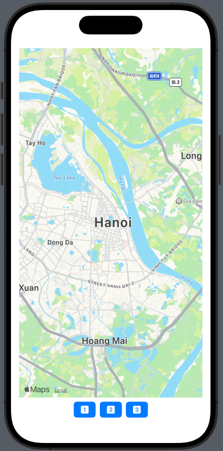

* Region #2

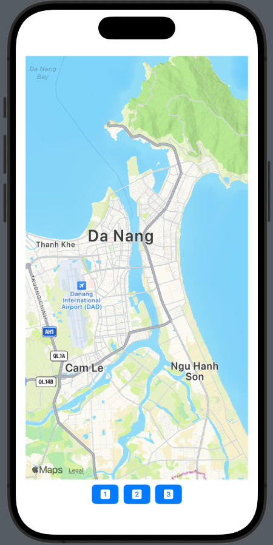

* Region #3

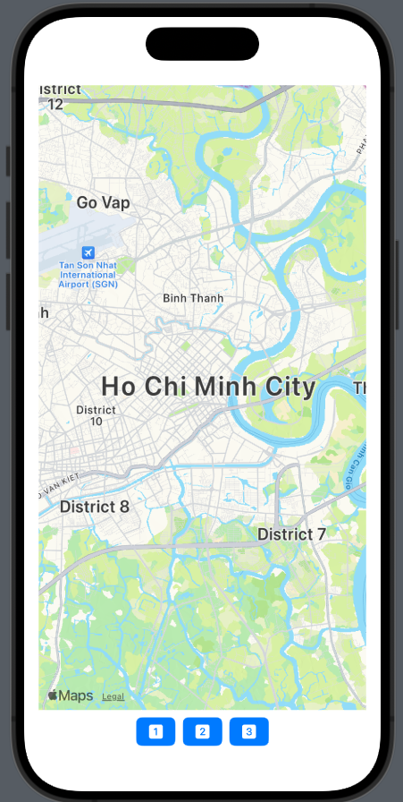


Tạm thời, mình xin hết thúc bài viết tại đây. Có cơ hội sẽ viết tiếp các phần tiếp theo cho MapKit trên SwiftUI, kha khá thứ thú vị đấy!

---
Hết