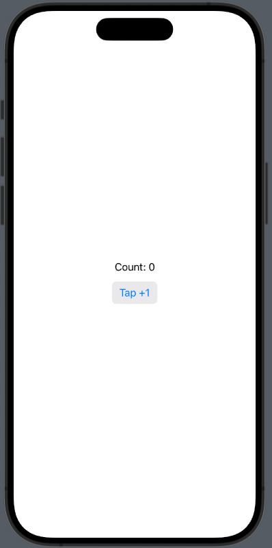
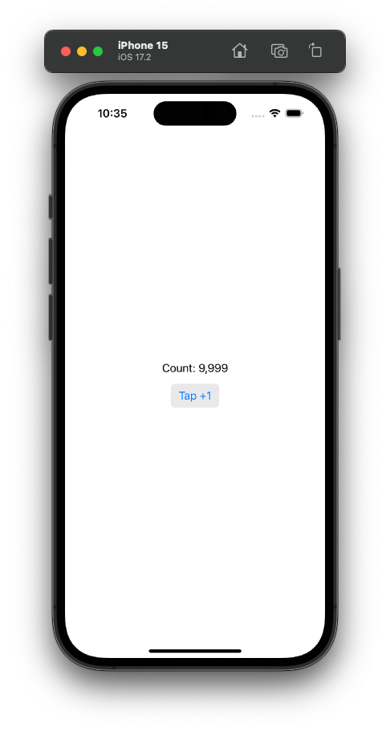
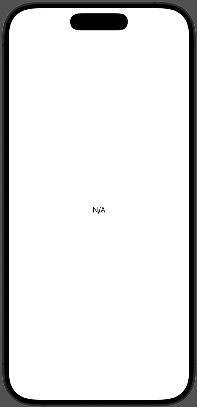

# Observation Demo

Chào mừng bạn đến với Fx Studio. Bài viết này sẽ nói về một thư viện mới của Apple, đó là **Observation**. Biết nó là gì thì chúng ta tiếp tục tìm hiểu nhóe.

## Observation là gì?

> Mọi thứ bắt đầu từ hư vô và lại trở lại từ hư vô mà thôi!

Observation Framework hay Observation cũng được, tùy cách bạn gọi sao cho dễ hiểu à. Nói về nó, đây là một thư viện mới mà Apple giới thiệu ở iOS 17 & Swift 5.9. Nó là một chuẩn mới giúp cho các lập trình viên giải quyết vấn đề lâu nay của họ.

Cụ thể hơn, ta đã biết trước khi có Swift 5.9. Các lập trình viên thiếu một chuẩn để thống nhất & cách hiệu quả để quan sát sự thay đổi đối với thuộc tính loại tham chiếu. Mô hình KƠV từ cái thời Objeactive-C, bị giới hạn trong phạm vị các lớp con NSObject. Còn về Combine thì ta không thể quan sát tới cấp thuộc tính của đối tượng. Và cả 2 đều thiếu việc hỗn trợ đa nền tảng. 

Do đó, đứa con cưng SwiftUI lại phải sống cùng lũ, nhưng về mặt hiệu năng lại không cao. Ngoài ra, nó là cho tư tưởng về The single source of truth cũng hơi rườm ra đi một chút. Bạn cần nhớ lại một chút về ObservableObject Protocol và các Property Wrapper như @Published, @EnvironmentObject, @StateObject.

> Dù sao đi nữa, bạn cũng phải bắn/lắng nghe với từng thuộc tính của một đối tượng kiểu tham chiếu mà thôi. Quá mợt mỏi đi mà!

Bây giờ với Swift 5.9, bạn đã có Observation Framework. Nó giải quyết các vấn đề rắc rối trên.

* Áp dụng cho tất cả các loại tham chiếu Swift, không chỉ các lớp con NSObject.
* Cung cấp khả năng quan sát cấp thuộc tính chính xác mà không cần chú thích đặc biệt.
* Giảm các cập nhật chế độ xem không cần thiết trong SwiftUI, cải thiện hiệu suất.

## Khai báo Observable Object

Đọc qua trên chắc nhiều bạn sẽ nỗ não thôi. Mình đã việt hóa khá nhiều cho mớ lý thuyết mới. Để dễ hiểu thì bạn hãy tiếp tục đọc tiếp phần ví dụ cho việc khai báo nhóe. Ít chữ, nhiều code chắc ổn hơn.

Với Combine, bạn khai báo một kiểu dữ liệu Observable theo dạng tham chiếu thì như sau:

```swift
class Store: ObservableObject {
    @Published var firstName: String
    @Published var lastName: String
    // ...
}
```

Với Observation thì nó đơn giản hơn một chút:

```swift
@Observable
class Store {
    var firstName: String = "Fx"
    var lastName: String = "Studio"
    // ...
}
```

Trong đó:

* Sử dụng duy nhất @Observable để trước khai báo class
* Không sử dụng các Wrapper @Published cho các thuộc tính loại lưu trữ (Store Properties) để bên ngoài có thể quan sát được
* Các Computed Properties cũng có thể quan sát được
* Nếu không muốn thuộc tính nào quan sát được thì thêm @ObservationIgnored trước khai báo thuộc tính

> EZ Game!

Về @Observable, nó là một Macro. Khác với @Published, là một Wrapper Properties. Nó một cách mới và đơn giản hơn để thực hiện phản hồi dạng xem đối với các thay đổi dữ liệu. Cung cấp mọi công cụ cần thiết để làm việc mới Observer Design Pattern trong Swift. Và nó được cài đặt sẵn trong core rồi, nên cứ thế mà quất thôi.

## The source of truth

Sau khi có một đối tượng Observable, chúng ta phải quyết định ai sở hữu dữ liệu này. Tùy thuộc vào ý đồ logic của bạn mà bạn có thể đặt nó ở đâu trong phân cấp view ứng dụng. Cho dù đặt ở đâu thì chúng ta cần có @State để xác định đó là nguồn duy nhất được sử dụng dụng.

Ví dụ đặt tại Root

```swift
@Observable class Store {
    ...
}

@main
struct ExampleApp: App {
    @State private var store = Store()

    var body: some Scene {
        ...
    }
}
```

Ví dụ đặt tại một View nào đó

```swift
@Observable class Store {
    ...
}

struct ContentView: View {
    @State private var store = Store()

    var body: some View {
        ...
    }
}
```

> Dễ chơi, dễ trúng thưởng!

## Dependency Injection via Environment

Ngoài cái The single source of truth, chúng ta vẫn còn cách để sử dụng nữa là truyền vào các biến môi trường. Điều này cũng giúp cho việc truyền data model tới các view con. Nếu bạn chưa quen với các Environment trong SwiftUI, thì có thể hiểu việc này như là một đối tượng Singleton và bạn có thể dùng ở bất kỳ đâu trong phân cấp view của bạn.

Trong SwiftUI, chúng ta có tới 2 cách sử dụng biến môi trường nhóe. Bắt đầu, mình sử dụng một Store đơn giản như sau:

```swift
@Observable class Store {
    var count: Int = 0
    
    init(count: Int = 0) {
        self.count = count
    }
}
```

### Custom EnvironmentKey

Với cách này, code của bạn sẽ trông chuyên nghiệp hơn. Bạn có thể quản lý tất cả chúng nó một cách đơn giản nữa. Việc đầu tiên, ta cần tạo ra một EnvironmentKey mới nha.

```swift
struct CustomStoreKey: EnvironmentKey {
    static var defaultValue = Store()
}
```

Quan trọng, struct Key mới của bạn cần conform với EnvironmentKey Protocol. Yêu cầu duy nhất cho giao thức này là bạn xác định giá trị mặc định cho Key. 
Sau đó, ta sẽ extension EnvironmentValues với một thuộc tính môi trường mới. 

> EnvironmentValues ​​là tập hợp các giá trị môi trường có thể truy cập được từ toàn bộ hệ thống phân cấp Views.

```swift
extension EnvironmentValues {

    var store: Store {
        get { self[CustomStoreKey.self] }
        set { self[CustomStoreKey.self] = newValue }
    }
    
}
```

Các View sẽ truy cập tới thông qua KeyPath là store nhóe! Còn cách dùng tại các View thì như sau:

```swift
struct ContentView: View {
    @Environment(\.store) private var store
    
    var body: some View {
        Text("Count: \(store.count)")
        Button("Tap +1") {
            store.count += 1
        }
        .buttonStyle(.bordered)
    }
}
```

Đây là cách bạn sử dụng giá trị mặc định của biến môi trường nhóe. Kết quả tại Preview như sau:



Còn muốn cung cấp một giá trị khác từ một store cho biến môi trường, thì bạn có thể truyền nó từ Root.

```swift
@main
struct ObservationDemoApp: App {
    
    @State private var myStore = Store(count: 9999)
    
    var body: some Scene {
        WindowGroup {
            ContentView()
                .environment(\.store, myStore)
        }
    }
}
```

Bây giờ, ContentView đã sử dụng giá trị mới là myStore. Bạn nhớ build lên để test nha, chứ đừng thắc mắc tại sao Preview của nó vẫn không thay đổi.



### Environment Object

Các thứ 2 thì đơn giản hơn nhiều. Bớt tạo thêm file hay thêm các struct. Bạn có thể khai báo một thuộc tính của view là biến môi trường với wrapper properties @@Environment. Ví dụ như sau:

```swift
struct SecondView: View {
    
    @Environment(Store.self) var store
    
    var body: some View {
        Text("Count: \(store.count)")
        Button("+1") {
            store.count += 1
        }
    }
}

#Preview {
    var testStore = Store(count: 8888)
    
    return SecondView()
        .environment(testStore)
}
```

Trong đó:

* Thuộc tính store của SecondView là một thuộc tính với kiểu là biến môi trường
* Khi muốn gán giá trị cho thuộc tính, bạn sử dụng modifier là .environment() và truyền giá trị vào

Tuy nhiên, cách này sẽ không an toàn, nếu bạn không gọi modifier & xét giá trị cho nó. Dẫn tới ứng dụng sẽ bị crash. Do đó, bạn cần thận trọng khi sử dụng cách này nha. Đây là giải pháp khi đưa chúng về Optional.

```swift
struct SecondView: View {
    
    @Environment(Store.self) var store: Store?
    
    var body: some View {
        if let count = store?.count {
            Text("Count: \(count)")
            Button("+1") {
                store?.count += 1
            }
        } else {
            Text("N/A")
        }
    }
}

#Preview {
    return SecondView()    
}
```

Ta không cần gọi và truyền giá trị tại Preview, còn SecondView vẫn hiển thị đẹp và mướt lắm.



## Passing Observable Object

Nếu bạn vẫn cảm thấy quá trời phức tạp thì hãy quay về cách truyền dữ liệu truyền thống. Khi truyền một đối tượng Observable Object thì cũng tương tự như bao đối tượng khác. Xem ví dụ nha!

```swift
struct ThirdView: View {
    
    @State var store = Store()
    
    var body: some View {
        SubThirdView(store: store)
    }
}

struct SubThirdView: View {
    let store : Store
    
    var body: some View {
        Text("Count: \(store.count)")
        Button("Tap +1") {
            store.count += 1
        }
        .buttonStyle(.bordered)
    }
}
```

Trong đó:

* Đối tượng Observable Object được truyền từ ThirdView sang SubThirdView trong hàm khởi tạo
* Với khai báo @State cho store để đảm bảo việc dữ liệu tập trung ở một nguồn duy nhất

Khi bạn tương tác dữ liệu, bạn sẽ thấy chúng ta chỉ cần thay đổi `store.count +=1` và không làm gì thêm cả. Kể cả việc hiển thị dữ liệu lên Text cũng không cần truy xuất ngược lại. Một khi giá trị thuộc tính count thay đổi, đối tượng Observable sẽ phát giá trị đi tới các View đang sử dụng. Khi đó, các View sẽ tự động thay đổi lại việc hiển thị.

> Đây là cái hay của SwiftUI à. Quá đơn giản!

## Bindable

Đây là một wrapper property mà hỗ trợ việc tạo liên kết 2 chiều (Binding two-way) với các thuộc tính có thể thay đổi được của các Observable Object. Bạn sẽ sử dụng cho những thành phần cần có loại liên kết (Binding) trước khi nó có thể thay đổi giá trị, ví dụ: TextField. Khi làm việc với các thành phần đó, bạn cần sử dụng Wrapper Property @Bindable trước var và let.

Ví dụ code:

```swift
struct CounterView: View {
    
    @Bindable var store = Store()
    
    var body: some View {
        VStack {
            VStack(alignment: .leading) {
                Text("Name: \(store.name)")
                Text("Count: \(store.count)")
                Button("Tap +1") {
                    store.count += 1
                }
                .buttonStyle(.bordered)
            }
            .padding(10)
            SubCounterView(store: store)
        }
        .padding(10)
    }
}

struct SubCounterView: View {
    
    @Bindable var store: Store
    
    var body: some View {
        TextField("", text: $store.name)
            .padding(10)
            .background(Color.accentColor)
    }
}
```

Thêm thuộc tính name kiểu String cho Store và tiến hành liên kết với một TextField ở một View con khác. Mọi thức vẫn hoạt động mượt lắm.

Còn ví dụ, bạn chỉ cần Binding ở cục bộ một vài chỗ và không muốn khai báo với @Bindable cho thuộc tính. Thì bạn vẫn có thể sử dụng chúng ở các View cục bộ nhóe. Xem qua ví dụ code tiếp nha:

```swift
struct ContentView: View {
    var store: Store
    
    var body: some View {
        @Bindable var bindableStore = store

        TextField("Name", text: $bindableStore.name)

    }
}
```

Mặc dù vẫn còn nhiều thứ hay liên quan tới Observation Framework này nữa, nhưng trong giới hạn bài viết thì chúng ta kết thúc bài viết này tại đây nhóe!

## Tạm kết

* Observation Framework tạo ra chuẩn và cách mạng hóa việc phát triển với các Observable Object cho kiểu tham chiếu
* Đơn giản & giải pháp thay thế cho các cơ chế trước đây như KVO hay Combine
* Kết hợp với SwiftUI để cải thiện hiệu năng & tương tác với người dùng tốt hơn

Tham khảo:

* [Migrating from the Observable Object protocol to the Observable macro](https://developer.apple.com/documentation/swiftui/migrating-from-the-observable-object-protocol-to-the-observable-macro)
* [Managing model data in your app](https://developer.apple.com/documentation/swiftui/managing-model-data-in-your-app)

---
Hết